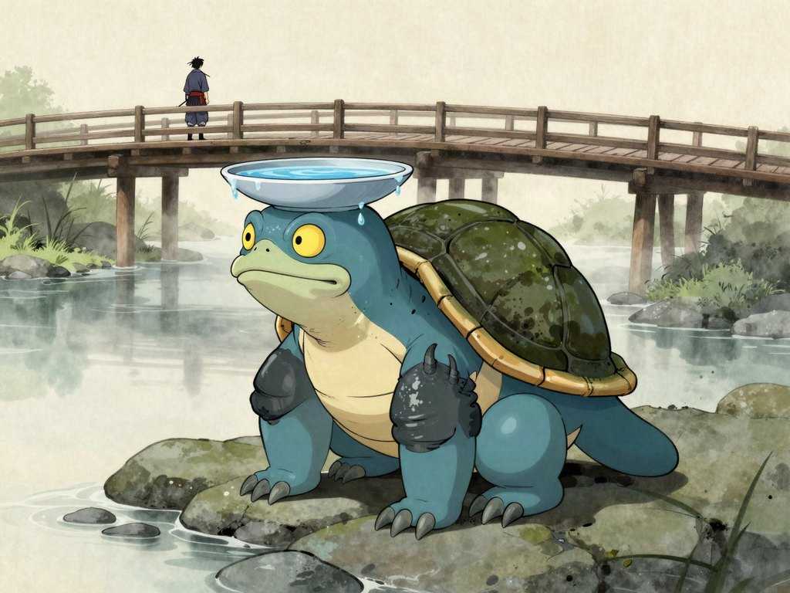
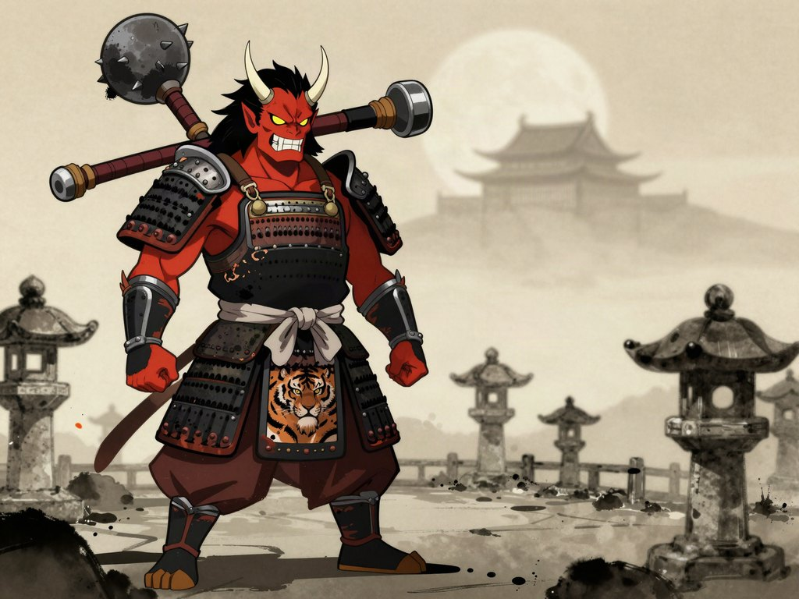
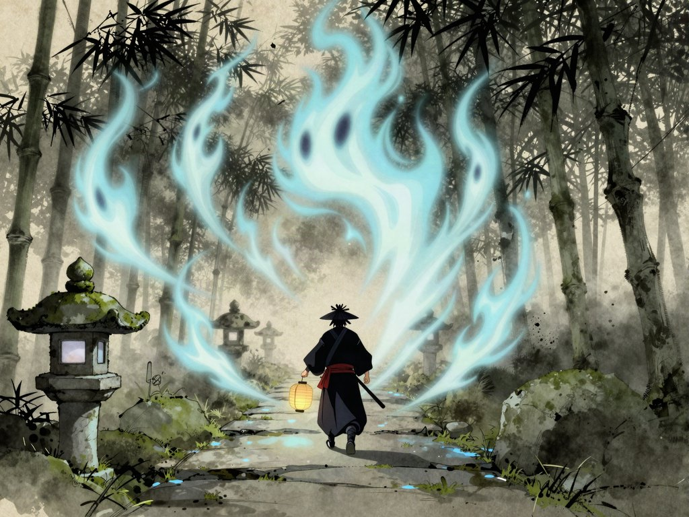
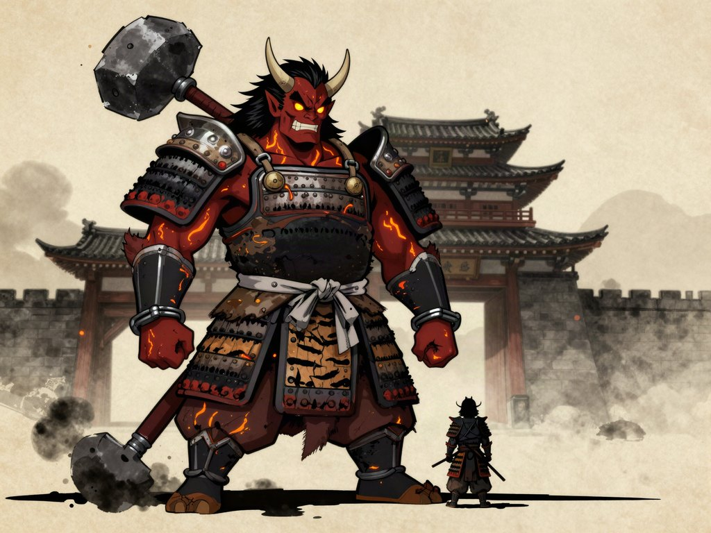
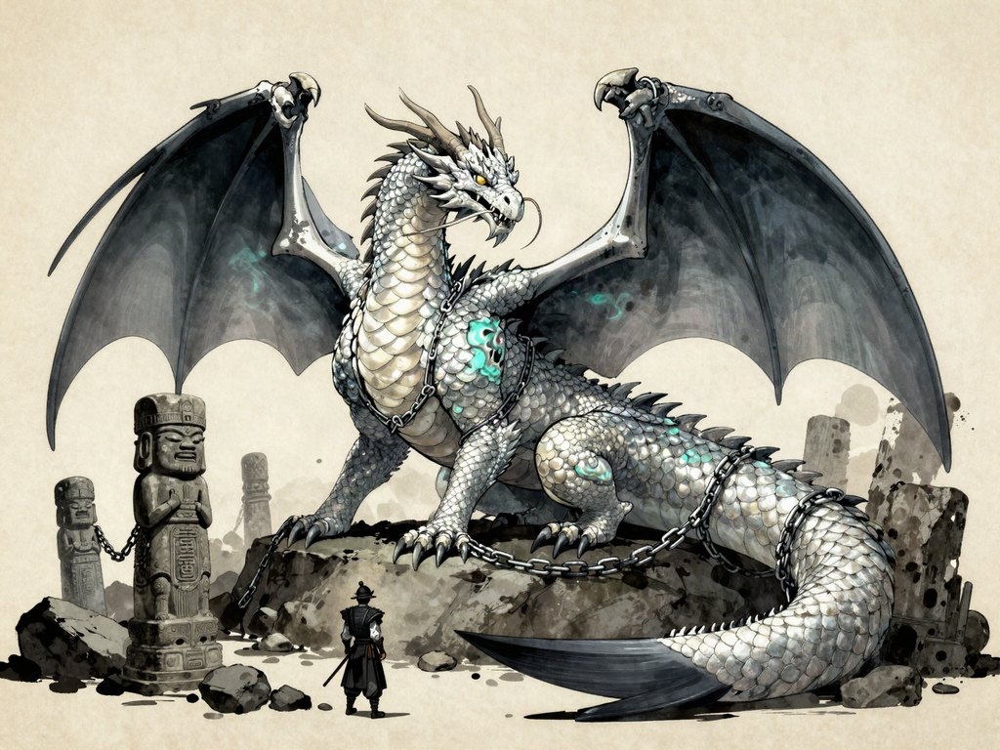

# RONIN — Bestiario

**Fecha:** 1 de octubre de 2026 · **Estado:** DECISIÓN 4 y **DECISIÓN 10 (B) cerradas el 1-10-2026**:
los yōkai japoneses son el núcleo, con sus variantes; las criaturas de otras tierras llegan a partir
del capítulo 3 y **Bahamut es el dragón**. Del bestiario, en el juego solo están los soldados de
Genzo. Lo marcado **[propuesta]** lo decides tú. La sinopsis (`HISTORIA.md`) está aprobada.

**Para la escala grande** (el catálogo de 939 criaturas, con ángeles y demonios, la variante fuerte de
cada una, el modelado y las imágenes en Colab) mira `BESTIARIO_UNIVERSAL.md`; los datos están en
`bestiario/`. Este documento sigue siendo el de las fichas por capítulo.

Etiquetas: **[Hecho]** leyenda o dato comprobado · **[Estimación]** cálculo con incertidumbre ·
**[Opinión]** criterio del equipo · **[propuesta]** idea para el juego, por decidir.

---

## 1. La regla que hace posible un bestiario grande: familias

Cada criatura cuesta un modelo, sus animaciones y su comportamiento. Con una persona, Claude y un
PC modesto, cien criaturas hechas de cero no se terminan nunca **[Estimación]**. La salida:
**familias**. Una familia comparte esqueleto, animaciones base y comportamiento. Una variante
cambia el aspecto, los colores y uno o dos ataques.

| Familia | De dónde sale | Criaturas |
| --- | --- | --- |
| **Bípedo** | El soldado actual | Kappa, oni, tengu, kitsune en forma humana, noppera-bō, hombres lagarto, goblins, ogros, vampiro, elfos, Genzo |
| **Flotante** | Nueva y la más barata (sin patas) | Onibi, hitodama, gaki, tsukumogami, kodama, hadas, ifrit, yuki-onna |
| **Gigante** | Jefes que se cortan por partes | Oni gigante, gashadokuro, daidarabotchi, umibōzu, gólem, titanes, Bahamut |
| **Cuadrúpedo** | Nueva | Okuri-inu, kamaitachi, bakeneko, kasha, raijū, komainu, nue, hombre lobo, Fenrir |
| **Reptante** | Nueva (serpientes, ciempiés, arañas) | Nure-onna, ōmukade, jorōgumo, tsuchigumo, Yamata no Orochi, isonade, Leviatán |
| **Alado** | Nueva | Karasu-tengu en vuelo, hō-ō, fénix, gárgolas |

- **Coste [Estimación]:** una variante es barata (días); una familia nueva es cara (semanas):
  esqueleto, animaciones y comportamiento nuevos.
- **Regla [propuesta]:** **como mucho una familia nueva por capítulo.** El capítulo 1 usa el
  bípedo (ya existe), estrena el flotante y tiene un gigante de jefe.

## 2. Los cuatro tipos de enemigo (y los jefes)

| Tipo | Qué enseña del iaidō |
| --- | --- |
| **Veloz** | Leer el aviso: ataca rápido y desde ángulos raros; se vence parando a tiempo |
| **Poderoso** | Paciencia: tiene golpes que no se pueden parar y hay que esquivar; tras fallar, queda abierto |
| **Enjambre** | Control: muchos débiles a la vez; cada golpe llena la barra y el corte de luna los barre |
| **Gigante** | Puntos débiles: se corta por partes y sus avisos son enormes |
| **Jefe** | Examen: junta lo aprendido en el capítulo y añade una idea propia |

## 3. Capítulo 1: las fichas completas (Must Have)

Junto a los soldados de Genzo, que ya están en el juego. Los números son **provisionales**:
se ajustan probando. Como referencia, el soldado actual avisa 0,5 s antes de atacar y aguanta
2 golpes.

### Kappa — veloz · bípedo (variante pequeña del soldado)

- **Leyenda [Hecho]:** yōkai de los ríos, con caparazón y pico. Lleva en la cabeza un plato
  (*sara*) con agua; si se le derrama, pierde la fuerza. Es muy cortés: si le haces una
  reverencia, la devuelve y se le cae el agua.
- **En el juego [propuesta]:** sale del agua (foso del castillo, río de la aldea) y se lanza en
  embestidas cortas. Avisa **0,3 s** (más rápido que el soldado), se mueve a 6 m/s y aguanta
  2 golpes.
- **Cómo se vence:** con el iai perfecto, que le derrama el agua y lo deja de un golpe. Si
  Akira se queda en postura de iai frente a él 2 s sin atacar, el kappa hace la reverencia y
  derrama el agua solo. Es un guiño a la leyenda y al tema del honor, y no necesita botón nuevo.
- **Enseña:** que el aviso puede ser corto; prepara para los veloces del capítulo 2.

### Oni — poderoso · bípedo (variante grande del soldado)

- **Leyenda [Hecho]:** ogro del folclore japonés con cuernos y un garrote de hierro (*kanabō*).
  En el Setsubun se le echa de casa tirando soja tostada.
- **En el juego [propuesta]:** dos ataques.
  - **Barrido** (aviso «!», 0,6 s): se puede parar. El iai perfecto lo aturde 1,5 s y le quita
    3 de vida, pero no lo mata.
  - **Golpe de kanabō** (aviso «!!» rojo, 0,9 s): no se puede parar. Hay que apartarse. Si
    falla, el garrote queda clavado 1 s y el oni queda abierto.
  - Vida: 6.
- **Variante [propuesta]:** el oni azul, más rápido, con tres barridos seguidos.
- **Enseña:** que no todo se para; leer el color del aviso.

### Onibi — enjambre · flotante (familia nueva, la más sencilla)

- **Leyenda [Hecho]:** fuegos fatuos; en la tradición son almas o fuegos de yōkai que flotan de
  noche.
- **En el juego [propuesta]:** grupos de 5-8 que giran alrededor de Akira y se lanzan de uno en
  uno (aviso 0,4 s). Queman 1 de vida al tocar y mueren de un golpe. Cada uno da espíritu, así que
  un grupo llena la barra para el corte de luna.
- **Enseña:** el corte de luna. Es la «batería» del especial.
- **Nota de arte [Opinión]:** el concepto salió más tierno que amenazante. Para el juego conviene
  más oscuro: caras más huecas y llama más fría.

### Oni gigante — jefe del capítulo 1, en el portón · gigante

- **Imagen (02-10-2026):** es la versión gigante del oni: 8 m, grietas de brasa, tres cuernos y
  grilletes rotos. Salió a la primera con armadura. Sin ella, el filtro de Higgsfield la había
  rechazado cuatro veces, porque toma el torso desnudo por un desnudo (`arte/conceptos/LEEME.md`).
- **En el juego [propuesta]:** derriba el portón para cerrar la huida.
  1. **Puñetazos:** su sombra marca dónde caerá el golpe (aviso enorme). Tras cada golpe, el brazo
     queda en el suelo: cortarlo 3 veces lo inutiliza. Son dos brazos.
  2. **De rodillas:** sin brazos, embiste con la cabeza. Un iai perfecto en la embestida lo
     remata, con la tinta del corte de luna sobre él.
- **Enseña:** puntos débiles y avisos grandes. Es el examen del capítulo.

## 4. Yōkai para los capítulos siguientes

| Criatura | Tipo | Leyenda en una línea [Hecho] | Idea de combate [propuesta] | Capítulo |
| --- | --- | --- | --- | --- |
| **Kamaitachi** | Veloz | Trío de comadrejas del viento: una derriba, otra corta y otra cura la herida | Siempre en trío; si queda viva la tercera, cura a las otras | 2 |
| **Okuri-inu** | Veloz, manada | Lobos que siguen al viajero de noche; si tropieza, lo atacan | Rodean sin atacar; si Akira cae o lo empujan, atacan todos | 2 |
| **Kitsune** | Poderoso, engaño | Zorros que cambian de forma; cuantas más colas, más poder | Copias falsas; el aviso de la copia no hace daño, hay que leer cuál es la real | 2 |
| **Tanuki** | Engaño | Tejón que se transforma por diversión | Se disfraza de estatua jizō: una «estatua de guardado» que muerde | 2 |
| **Noppera-bō** | Engaño | Fantasma sin cara que se hace pasar por conocidos | Duelo espejo: copia los movimientos de Akira; en la historia, suplanta a un aliado | 2 |
| **Hitodama** | Enjambre | Almas con forma de llama | Variante del onibi | 2 |
| **Tsukumogami** | Enjambre, sorpresa | Objetos de cien años que cobran vida (farolillos, paraguas) | Los farolillos del templo despiertan; variante barata del onibi | 2 |
| **Kodama** | Aliado | Espíritus de los árboles | No atacan: guían en el Kakuriyo | 2 |
| **Karasu-tengu** | Veloz | Hombres cuervo de las montañas, maestros de la espada | Duelo rápido; bajan en picado | 2 |
| **Sōjōbō** | Jefe | Rey de los tengu; enseñó esgrima a Minamoto no Yoshitsune en el monte Kurama | Duelo de iaidō puro; al vencerle, enseña una técnica nueva **[propuesta: jefe del capítulo 2]** | 2 |
| **Komainu de piedra** | Gigante lento | Leones-perro que guardan los santuarios (las «gárgolas» japonesas) | Invulnerables de frente; despiertan si se cruza sin respeto | 3 |
| **Dogū y haniwa** | Enjambre y gigante | Figuras de barro reales: dogū del periodo Jōmon (hasta ~300 a. C.) y haniwa de las tumbas Kofun (siglos III-VI) | **[propuesta]** autómatas de una civilización olvidada que guardan el sello de Bahamut: los «robots antiguos» de tu lista | 3 |
| **Jorōgumo** | Poderoso | Araña que toma la forma de una mujer hermosa | Telas que atrapan (atrapado, no hay iai) y crías en enjambre | 3 |
| **Tsuchigumo** | Gigante | Araña gigante de tierra, vencida por Minamoto no Raikō | Jefe intermedio en las ruinas | 3 |
| **Ōmukade** | Gigante, reptante | Ciempiés gigante del monte Mikami, vencido por Tawara Tōda con una flecha mojada en saliva | Cada segmento es un punto débil; la cabeza solo se expone tras un iai perfecto | 3 |
| **Gaki** | Enjambre | Fantasmas hambrientos del budismo | Hordas lentas que se agarran; el corte de luna las barre | 3 |
| **Kasha** | Poderoso, fuego | Gato demonio que roba cadáveres en los funerales, entre llamas | Rueda de fuego y suelo ardiendo (el «ifrit» japonés) | 4 |
| **Nue** | Poderoso, quimera | Cara de mono, cuerpo de tanuki, patas de tigre y cola de serpiente; Minamoto no Yorimasa lo derribó de una flecha | Cada parte ataca distinto; llega con nubes negras | 4 |
| **Gashadokuro** | Gigante | Esqueleto gigante hecho de los huesos de los muertos sin enterrar | Se desarma y se vuelve a montar; aparece en la planicie de noche. **[Hecho]:** es un yōkai moderno (1966), unido después a un grabado de Kuniyoshi | 4 |
| **Bakeneko** | Veloz | Gato que vive tanto que le crece una segunda cola y aprende a transformarse | Salta entre tejados en la aldea | Después |
| **Raijū** | Veloz | Bestia del trueno que acompaña al dios Raijin | Carga en zigzag; el destello del rayo es el aviso | Después |
| **Yuki-onna** | Poderosa | Mujer de las nieves que congela con el aliento | El frío ralentiza a Akira; el iai perfecto rompe el hielo | Después |
| **Nure-onna** | Poderosa | Cuerpo de serpiente y cabeza de mujer; chupa la sangre (la «vampira» japonesa) | Agarra desde el agua y drena vida | Después |
| **Ningyo y gyojin** | Veloz, agua | El ningyo es un pez con cara humana: comer su carne da una vida larguísima | Atacan desde abajo en el agua (las «sirenas» japonesas) | Después |
| **Umibōzu** | Gigante, mar | Monje marino gigante que hunde barcas | Jefe del mar (el «kaijū» japonés) | Después |
| **Isonade** | Veloz, mar | Pez monstruo que arrastra a los marineros con la cola llena de garfios | Persecución en barca | Después |
| **Daidarabotchi** | Gigante | Gigante que formó montañas y lagos | Jefe-escenario: se escala (el «titán» japonés) | Después |
| **Yamata no Orochi** | Jefe | Serpiente de ocho cabezas; Susanoo la venció y sacó de su cola la espada Kusanagi | Ocho cabezas, ocho puntos débiles | Después |
| **Ashura** | Jefe | Guerrero de varios brazos del budismo (el «asura» de tu lista) | Combos de seis espadas; parar en cadena | Después |
| **Los cuatro dioses** | Jefes | Seiryū (dragón), Suzaku (ave), Byakko (tigre blanco) y Genbu (tortuga-serpiente) protegían la antigua capital | **[propuesta]** guardianes de los cuatro pilares del kekkai; Byakko es tu «tigre legendario» | Después |
| **Hō-ō** | Aliado o jefe | Ave sagrada que aparece en tiempos de paz (el «fénix» japonés) | Jefe aéreo, o aliado al final | Después |
| **Emisarios de la luna** | Poderosos | En el *Cuento del cortador de bambú* bajan de la luna a por la princesa Kaguya, y los soldados del emperador pierden las fuerzas para luchar | Paralizan; solo un iai perfecto rompe la parálisis | Después |
| **Tsukuyomi** | Jefe final posible | Dios de la luna del sintoísmo, hermano de Amaterasu | «La luna» de tu lista: amenaza final o aliado ambiguo **[propuesta]** | Después |

## 5. Criaturas de otras tierras

**[propuesta, depende de la DECISIÓN 8]** Cuando cae el kekkai, las grietas no solo se abren al
Kakuriyo. También se abren al «más allá» de otras tierras, y por ahí llegan las criaturas
extranjeras de tu lista. Llegan **a partir del capítulo 3**: así los primeros capítulos dejan
clara la identidad japonesa y la llegada de lo extranjero es una escalada (ver DECISIÓN 10).

| Criatura | De dónde viene [Hecho] | Tipo | Idea de combate [propuesta] | Capítulo |
| --- | --- | --- | --- | --- |
| **Hombres lagarto** | Fantasía moderna | Bípedo | El séquito de Bahamut: llegaron con él y quieren liberarlo | 3 |
| **Goblins y hobgoblins** | Folclore inglés | Enjambre | Bandas que saquean las ruinas; el hobgoblin es su capitán | 3 |
| **Slime** | Fantasía moderna (*D&D*, *Dragon Quest*), no un mito | Enjambre | Se divide al cortarlo: el corte de luna es la respuesta | 3 |
| **Gárgolas** | Arquitectura gótica de Europa | Alado | De piedra mientras se las mira; atacan por la espalda | 3 |
| **Gólem** | Folclore judío (el gólem de Praga) | Gigante | Lleva una palabra escrita en la frente: borrar una letra lo apaga | 3 |
| **Vampiro** | Folclore eslavo y balcánico | Poderoso | Drena vida y se vuelve niebla; frente a él, el iai perfecto | 4 |
| **Hombre lobo** | Folclore europeo | Veloz | Humano hasta que sale la luna roja | 4 |
| **Elfos oscuros** | Mitología nórdica (*svartálfar*) | Poderoso | Arcos y magia desde lejos | 4 |
| **Ogros** | Cuentos franceses | Poderoso | El primo extranjero del oni: pelean entre ellos | 4 |
| **Ifrit** | Mitología árabe (un tipo de genio) | Poderoso, fuego | Pareja con el kasha | 4 |
| **Doppelgänger** | Folclore alemán | Engaño | Copia exacta de Akira; prepara el duelo con Genzo | 4 |
| **Hadas y elfos** | Folclore celta y germánico | Enjambre o aliados | Luces que confunden en el bosque | Después |
| **Sirenas** | Mitología griega y europea | Agua | Su canto atrae a Akira hacia el agua | Después |
| **Fenrir** | Mitología nórdica (el lobo encadenado) | Gigante | Otro gigante encadenado, como Bahamut | Después |
| **Titanes** | Mitología griega | Gigante | Jefes-escenario | Después |
| **Leviatán** | Biblia hebrea | Gigante, mar | Jefe del mar extranjero, rival del umibōzu | Después |
| **Fénix** | Mitología griega y egipcia | Alado | Renace: hay que vencerlo dos veces | Después |
| **Bahamut** | Cosmología árabe (ver §6) | Gigante, alado | El rey de los dragones | 3 (jefe) |

## 6. Bahamut, el dragón

- **Origen [Hecho]:** en la cosmografía árabe medieval, Bahamut es un **pez cósmico**
  inmenso que sostiene el mundo desde las aguas más profundas. *Dungeons & Dragons* lo convirtió
  en el Dragón de Platino, rey de los dragones buenos, y *Final Fantasy* lo hizo famoso como rey
  de los dragones.
- **Riesgo [Opinión, no es asesoría legal]:** el nombre viene de un mito y es libre. Pero la
  imagen de «rey dragón» que tiene el público es la de *Final Fantasy*. Para que no parezca una
  copia, el diseño y los nombres de los ataques tienen que ser propios (nada de «Megaflare» ni
  parecidos).
- **Nuestra versión [propuesta]:** une los dos orígenes. Es un dragón de escamas de nácar con
  aletas de pez abisal: el pez que sostenía el mundo y que acabó siendo rey de los dragones.
  - Hace milenios cruzó una grieta, y la civilización de los dogū lo encadenó en las ruinas.
  - Al caer el kekkai, el sello se debilita.
  - Sus hombres lagarto quieren liberarlo; los autómatas lo siguen guardando; el gran yōkai lo
    quiere de su lado.
- **El combate (jefe del capítulo 3) [propuesta]:**
  1. **Encadenado:** cada cadena sale de un dogū gigante. Hay que romper los sellos mientras sus
     coletazos te buscan; los coletazos se paran con iai.
  2. **Libre:** su aliento se carga con un brillo (aviso largo) y sale como un río de luz. Un iai
     perfecto en el instante justo **parte el aliento en dos**: la imagen del tráiler.
  3. **Herido en el suelo:** puntos débiles en alas y aletas. El final es el corte de luna, con las
     líneas de tinta sobre un dragón gigante.
- **Después [Nice to Have]:** puede morir, volver a dormir o unirse a Akira como invocación.
  Queda abierto.
- **Concepto:** la versión 2 (arriba) ya tiene buena anatomía. Los guardianes de piedra parecen
  más tótems que dogū; se corregirá al hacer la escena. La versión 1, con forma más humana y una
  aureola, está en Drive como alternativa, pero su cola acababa en otra cabeza.

## 7. El bestiario dentro del juego [propuesta, Should Have]

- **Qué es:** un menú «Bestiario». Cada criatura vencida desbloquea su ficha: la ilustración 2D,
  la leyenda real y cómo vencerla.
- **Por qué:**
  - Da una razón para volver: completarlo.
  - Los encargos de caza de la aldea apuntan a fichas incompletas. La caza se juega; no hay
    farmeo automático (DECISIÓN 7).
  - Reutiliza las imágenes 2D que ya estamos haciendo.
- **Marketing [Opinión]:** las leyendas reales dan contenido fácil para TikTok o YouTube, del
  tipo «el yōkai de hoy». Gancho real **[Hecho]**: la piedra donde, según la leyenda, quedó sellada
  Tamamo-no-Mae (la *Sesshō-seki*, en Nasu) se partió en dos el 5 de marzo de 2022, y se hizo
  viral como «el espíritu se ha liberado». Si en la DECISIÓN 9 eliges a Tamamo-no-Mae, la campaña
  tiene una historia real detrás.
- **Coste [Estimación]:** bajo, un menú con textos. Las imágenes ya se están haciendo.

## 8. Reparto por capítulos (resumen)

| Capítulo | Yōkai | De otras tierras | Jefe | Familia nueva |
| --- | --- | --- | --- | --- |
| 1 · La noche de Hoshiyama | Soldados de Genzo, kappa, oni, onibi | — | Oni gigante | Flotante (y el primer gigante) |
| 2 · El velo | Kamaitachi, okuri-inu, kitsune, tanuki, noppera-bō, hitodama, tsukumogami, tengu; kodama como aliados | — | Sōjōbō | Cuadrúpedo |
| 3 · Lo que dormía | Dogū y haniwa, komainu, jorōgumo, tsuchigumo, ōmukade, gaki | Hombres lagarto, goblins, slime, gárgolas, gólem | Bahamut | Reptante |
| 4 · El regreso | Kasha, nue, gashadokuro | Vampiro, hombre lobo, elfos oscuros, ogros, ifrit, doppelgänger | Genzo y el gran yōkai | Ninguna (todo variantes) |
| Después del lanzamiento | Mar, cielo, nieve y luna: umibōzu, ningyo, raijū, yuki-onna, hō-ō, los cuatro dioses, emisarios de la luna, Tsukuyomi, Orochi, ashura… | Sirenas, hadas, elfos, Fenrir, titanes, Leviatán, fénix | Por definir | Alado |

En total salen más de 50 criaturas. El capítulo 1 se queda en 4 más los soldados, como estaba
previsto. El resto llega capítulo a capítulo, que es justo lo que permite el lanzamiento por
capítulos.

## 9. Decisión que necesito de ti

### DECISIÓN 10 — Cuándo llegan las criaturas de otras tierras · **DECIDIDA el 1-10-2026: B**
- **OPCIONES:**
  - A) desde el capítulo 1;
  - B) desde el capítulo 3, cuando despierta Bahamut;
  - C) solo en capítulos extra después del lanzamiento.
- **VENTAJAS:**
  - A da variedad conocida desde el principio.
  - B deja clara la identidad japonesa al empezar y convierte la llegada en una escalada.
  - C mantiene el juego base cien por cien japonés.
- **RIESGOS:**
  - A: el primer vídeo del juego mezclaría vampiros con samuráis y se perdería lo que lo hace
    distinto.
  - B: hay que contar bien por qué llegan (la grieta de Bahamut).
  - C: tus criaturas favoritas tardarían mucho en salir.
- **COSTE:** igual en las tres; cambia el orden, no el trabajo.
- **RECOMENDACIÓN:** **B.**
- **SIGUIENTE PASO:** fichas completas, como las del capítulo 1, de las criaturas del capítulo 2.
- **Cómo quedó:** nada que no sea japonés aparece antes del capítulo 3. En el catálogo grande, el
  capítulo 3 abre el continente y Oriente Próximo; el 4, Europa; el resto, tras el lanzamiento
  (`BESTIARIO_UNIVERSAL.md` §7).
