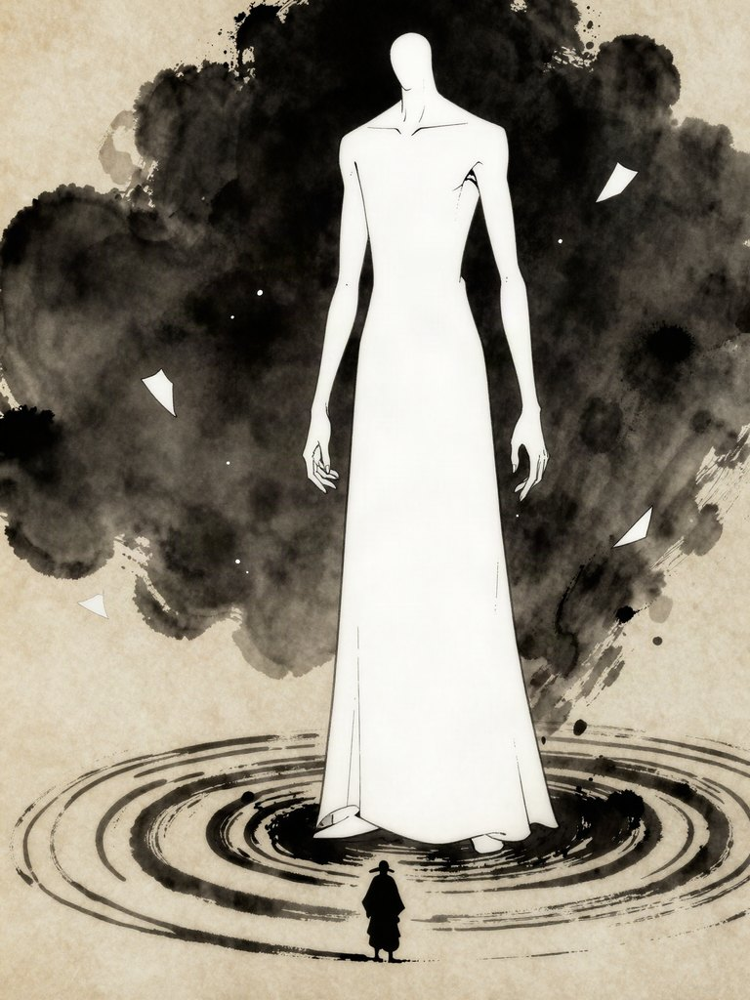

# RONIN — Sinopsis

**Estado:** **aprobada el 1-10-2026** (DECISIÓN 8A: tal cual, con los textos nuevos del capítulo 1;
DECISIÓN 9A: el gran yōkai es Tamamo-no-Mae). Los textos del capítulo 1 ya están cambiados en
`godot/scripts/datos.gd`; llegarán al APK con la próxima versión. Lo marcado como **[propuesta]**
sigue sin decidir; hoy es la capa del Silencio (§8, DECISIÓN 11).

Etiquetas: **[Hecho]** comprobado · **[propuesta]** idea para decidir · **[Opinión]** criterio del
equipo.

---

## 1. En una línea

*Un ronin persigue al general que mató al shōgun, y descubre que el general solo era el peón del
yōkai más antiguo de Japón… mientras medio pueblo le da la razón al general.*

## 2. El mundo

- **Japón en la era de los yōkai:** leyendas, monstruos, fantasmas y mitos están en su época más
  activa.
- **Dos planos:** *Utsushiyo*, el mundo de los humanos, y *Kakuriyo*, el mundo oculto de los yōkai.
  Así los llamaba la tradición sintoísta.
- **El kekkai:** durante generaciones, el shōgun mantenía una barrera que separaba los dos mundos.
  Por eso los yōkai cruzaban poco, y solo por las grietas.
- **Criaturas de otras tierras (DECISIÓN 10B):** cuando la barrera cae, las grietas no solo se abren
  al Kakuriyo. También se abren al «más allá» de otras tierras. Llegan **a partir del capítulo 3**:
  Bahamut, vampiros, gárgolas, elfos, y también los ángeles y los demonios (`BESTIARIO_UNIVERSAL.md`).

## 3. Los personajes

| Personaje | Quién es | Qué quiere |
| --- | --- | --- |
| **Akira** | Guardia personal del shōgun. Domina el iaidō. | Fuera, justicia; dentro, recuperar el honor que perdió al no proteger a su señor |
| **Shōgun Takeda** | Señor de Japón, desde el castillo de Hoshiyama. Mantiene el kekkai. | Convivir con los yōkai sin guerras; se niega a sacrificar aldeas para reforzar la barrera |
| **General Genzo** | Mano derecha del shōgun. | Proteger Japón a cualquier precio. Cree que Takeda es demasiado blando y que el kekkai se está muriendo |
| **Tamamo-no-Mae** | El gran yōkai: la zorra de nueve colas. | Poner todo Japón bajo el mando de los monstruos |

## 4. La historia

1. **El pacto (antes del juego):** Tamamo-no-Mae, con forma de consejera de corte, le susurra a Genzo
   una salida. Si el shōgun cae, ella ordenará a los yōkai que no toquen sus tierras. Genzo acepta:
   cree que pierde a un señor para salvar a un pueblo.
2. **La noche de Hoshiyama (capítulo 1):** Genzo mata al shōgun. Con él cae el kekkai y, esa misma
   noche, los primeros yōkai cruzan al patio del castillo. Los soldados ya obedecen a Genzo. Akira
   se abre paso entre soldados y yōkai, sale a la planicie y llega a la aldea.
3. **La grieta crece (capítulos siguientes):** en las tierras de Genzo los ataques bajan, porque
   Tamamo cumple su parte para que el pueblo apoye al general. En el resto de Japón, las grietas se
   multiplican. Akira viaja por el templo, el dojo, las ruinas y la planicie, y cruza al Kakuriyo
   cuando hace falta.
4. **El regreso (final):** Akira vuelve a Hoshiyama. Genzo descubre que fue un peón. La historia se
   cierra donde empezó, frente a Tamamo-no-Mae, con la barrera por rehacer.

**Lo que se mantiene de la historia base:** Akira guardia y luego ronin; Genzo mano derecha que mata
a su señor por creerlo demasiado blando; Genzo no se ve como villano y parte del pueblo lo apoya;
justicia por fuera y honor por dentro; empieza y termina en Hoshiyama.

## 5. Textos del capítulo 1 (aplicados en `datos.gd` el 1-10-2026)

**Intro:**

1. «Castillo de Hoshiyama. Akira sirve como guardia del shōgun Takeda, el señor de Japón.»
2. «Esta noche, el general Genzo, su mano derecha, lo ha asesinado. Para Genzo, el shōgun era
   demasiado blando con los yōkai.»
3. «Con el shōgun cae la barrera que separaba los mundos. Los soldados ya obedecen a Genzo y algo se
   mueve en las sombras del patio. Akira debe abrirse paso hasta la puerta y escapar.»

**Cierre:**

1. «Akira cruza la última puerta. El castillo de Hoshiyama queda a su espalda.»
2. «Sin señor al que servir, desde esta noche es un ronin.»
3. «Fuera buscará justicia. Dentro, intentará recuperar su honor. Y sobre Japón, la luna brilla más
   roja que nunca.»

## 6. Capítulos (lanzamiento por capítulos, opción C)

| Capítulo | Lugares | Lo que pasa | Jefe |
| --- | --- | --- | --- |
| 1 · La noche de Hoshiyama | Castillo, planicie, aldea | La traición, la caída del kekkai y la huida | Oni gigante en el portón |
| 2 · El velo | Templo, dojo | Akira aprende a cruzar al Kakuriyo y nuevas técnicas de iaidō | Sōjōbō, rey de los tengu |
| 3 · Lo que dormía | Ruinas | Una civilización olvidada: autómatas dogū y haniwa; Bahamut atrapado; llegan las criaturas de otras tierras | Bahamut |
| 4 · El regreso | Planicie, Hoshiyama | Genzo y Tamamo-no-Mae | Tamamo-no-Mae |

## 7. Tamamo-no-Mae, el gran yōkai (ficha)

**La leyenda [Hecho]:** Tamamo-no-Mae era la favorita de la corte del emperador Konoe (1142-1155).
Cuando el emperador enfermó sin explicación, el astrólogo Abe no Yasuchika descubrió que era una
zorra de nueve colas. Huyó a la llanura de Nasu, donde la mataron los comandantes Kazusa-no-suke y
Miura-no-suke, y su espíritu quedó en una piedra, la *Sesshō-seki* («piedra asesina»), que emitía
gas venenoso. El monje Gennō Shinshō la apaciguó con un rito. La piedra se partió en dos el 5 de
marzo de 2022 y la noticia se hizo viral. La tradición cuenta además que la misma zorra había
poseído antes a gobernantes en India (Lady Kayō) y China (Daji y Bao Si): **ya había cruzado
fronteras antes que las criaturas de otras tierras** ([Wikipedia](https://en.wikipedia.org/wiki/Tamamo-no-Mae)).

**Su versión en RONIN [propuesta]:**

| | |
| --- | --- |
| **Formas** | Consejera de corte (la que habla con Genzo) · dama con máscara de zorro (la que se enfrenta a Akira) · zorra de nueve colas (la forma final, grande como un templo) |
| **Poderes** | Ilusiones (el golpe falso no hace daño: hay que leer cuál es el real) · fuego fatuo violeta · posesión de soldados · colas que atacan como látigos |
| **Por qué quiere Japón** | Lleva siglos viendo cómo los humanos la cazan, la sellan y la olvidan. No quiere destruirlos: quiere que sirvan |
| **Lo que no sabe** | La piedra de Nasu no solo la retenía a ella. Al partirse, algo más se movió (ver §8) |
| **Dónde se la ve** | Capítulo 1: solo su sombra y su voz. Capítulo 2: una ilusión. Capítulo 4: combate en tres fases, una por forma |

Concepto 2D: `arte/conceptos/gran_yokai.jpg`. Ficha de combate: `BESTIARIO.md`.

## 8. Capa nueva: el ser de la oscuridad silenciosa [propuesta]

Tu idea: *un monstruo inventado, nacido de la oscuridad silenciosa de un lugar donde ni los monstruos
ni los yōkai quieren entrar, que pone el equilibrio en quiebra.* Así lo ordeno, sin tocar lo aprobado:

**Idea.** Hay un tercer lugar, más allá de Utsushiyo y Kakuriyo. En japonés antiguo, la tradición
llama *ma* (間) al intervalo entre las cosas. Este es el **Ma no Yami**, «el espacio oscuro entre
mundos»: no hay luz, no hay sonido, no hay nombres. Los yōkai lo evitan porque allí dejan de ser
alguien. El kekkai nunca fue solo una pared entre dos mundos: **era el sello de ese tercer lugar**.

**El ser.** Nombre de trabajo: **Shijima** (しじま), palabra del japonés antiguo para «silencio, quietud»
[Hecho: *shijima* es una palabra de origen japonés (*yamato kotoba*) que significa silencio y que antes
quería decir «sin palabras»; fuente: [Kotobank](https://kotobank.jp/word/%E3%81%97%E3%81%98%E3%81%BE-519145)].
No odia ni quiere gobernar. **Deshace**: sonidos, colores, nombres, recuerdos. Cuando se acerca a una
criatura, esta se vuelve hueca y blanca; así nace el rango **Silenciado**.

**Cómo se ve [propuesta].** Una figura altísima y delgada, sin rostro, sin máscara y sin ropa: **un
hueco en la tinta**, de papel en blanco con un contorno roto, que borra el paisaje oscuro a su
alrededor y deja anillos de silencio en el suelo. Se ve desde lejos, y por eso el jugador siente la
escala. Concepto: `arte/conceptos/shijima.jpg`.

*Dos avisos de diseño:* la primera versión que generé (máscara blanca lisa y túnica negra) se parecía
demasiado a *Kaonashi* («Sin Cara», de *El viaje de Chihiro*, de Studio Ghibli), así que la descarté. Esta
segunda solo «evoca» de lejos al personaje de internet Slender Man por ser alta y sin rostro; el
diseño final debe añadir rasgos propios (el contorno roto, los borrones de tinta, los anillos) para
que no se confunda con ninguno de los dos.

**Cómo encaja con lo aprobado.**
- Genzo cree que salva Japón y Tamamo cree que lo va a gobernar. **Ninguno de los dos sabe lo que
  sellaba el kekkai.**
- La piedra de Nasu, al partirse, y la muerte del shōgun, al romper el kekkai, son las dos grietas por
  las que se asoma. Es la causa de que en el capítulo 3 lleguen criaturas de otras tierras: Shijima
  empuja todo lo que encuentra por delante.
- El equilibrio que se rompe no es «humanos contra yōkai»: es **todo contra el silencio**. Eso da un
  final posible en el que Akira, Genzo y hasta Tamamo tienen que decidir si se enfrentan juntos.

**Cómo se juega (aquí el iaidō se vuelve más puro).**
- Cerca de un Silenciado se apaga el sonido del juego, incluido el golpe de madera (*hyoshigi*) que
  avisa del ataque. **Hay que parar mirando, no oyendo.** El «!» se ve pálido y sin marco.
- La pantalla se vuelve tinta y papel, con el mismo filtro de los cuadros de impacto del iai.
- En el combate final, desaparece el HUD: sin barra de vida ni de espíritu. Solo Akira y la luna.

### DECISIÓN 11 — Qué papel tiene el Silencio
- **OPCIONES:**
  - A) **Ninguno:** el final es Tamamo-no-Mae, como está aprobado.
  - B) **Gancho final:** Tamamo-no-Mae sigue siendo el villano del juego. El capítulo 4 termina con la
    primera aparición de Shijima (la promesa de una continuación), y el rango **Silenciado** aparece
    como enemigo de final de juego y de rejugar.
  - C) **Amenaza final:** Shijima sustituye a Tamamo como último enemigo; Tamamo pasa a ser una
    aliada incómoda en el capítulo 4.
- **VENTAJAS:** A deja la historia como estaba. B conserva la historia aprobada, da contenido para
  después del final (y a cada criatura su variante más fuerte) y un gancho de continuación. C es la
  versión más grande del «equilibrio roto» que describiste.
- **RIESGOS:** A no usa tu idea. B pide sembrar el Silencio desde el capítulo 1 sin que estorbe. C
  cambia el final aprobado y recarga el capítulo 4 (más jefes y más escenas).
- **COSTE:** A, ninguno. B, bajo: rango de enemigos con sonido apagado y un tono visual más. C, alto:
  es otro jefe final y otras escenas.
- **RECOMENDACIÓN:** **B.** Respeta lo que ya aprobaste, sirve a la idea de los mil monstruos (el
  rango Silenciado multiplica el bestiario sin modelos nuevos) y el truco del sonido encaja con el
  iaidō. Se puede pasar a C más adelante si la gente quiere más.
- **SIGUIENTE PASO:** ficha completa de Shijima (aspecto, fases del combate final y escenas) y
  prueba del efecto de silencio en el prototipo (apagar el audio cerca de un enemigo).
- **Nombre:** si no te convence *Shijima*, otras opciones: *Mugon* (無言, «sin palabras») o *Ma no
  Yami* (間の闇, «la oscuridad del intervalo»).
